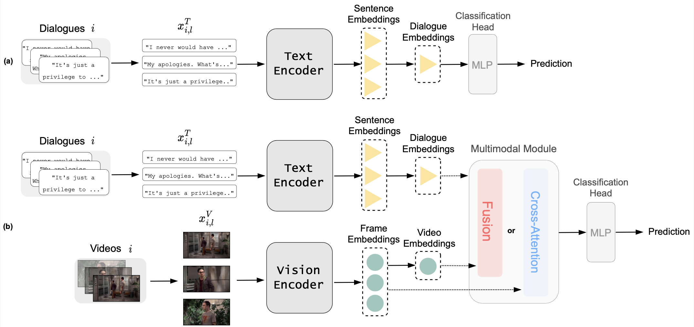

## Transformer-Based Multimodal Sarcasm Detection in Film

Sarcasm is often communicated through spoken words linked together with *verbal* elements, e.g. varying tones, and *visual* elements, e.g. facial expressions, all of which occur *over time*. However, current state-of-the-art works for sarcasm detection either focus only on textual elements or use a static combination of textual and visual elements. The temporal context crucial in cinematic storytelling is thus often neglected. To address this issue, a *multimodal* deep learning approach that considers *dynamic* textual and visual information is proposed in this thesis. For this purpose, a **Tra**nsformer-based **M**ultimodal **S**arcasm **D**etection network (TraMSD) is designed to focus on multimodal context-relevant information. TraMSD integrates pre-trained Transformer encoders for text and vision, respectively, and combines these unimodal features with a multimodal module to learn patterns indicative of sarcasm that are shared across modalities. The multimodal module comes in two flavours, one that leverages a late fusion while the other uses a cross-attention mechanism.
The proposed method is compared against a unimodal text-only baseline and a current state-of-the-art multimodal approach. Extensive experiments demonstrate that TraMSD outperforms the baselines particularly when employing the cross-attention module. The network utilises max pooling to highlight significant sentence features, and applies attention pooling to emphasise sentences that of importance for conveying sarcasm. An ablation study provides insights on the generalisability of TraMSD and explores the potential of the model in low data regimes.
Overall, TraMSD presents a novel approach to multimodal sarcasm detection in film, laying a strong foundation for future advancements in this field. 

## Dataset

The transformer approache has been trained and evaluated on the [MUStARD++](https://github.com/cfiltnlp/MUStARD_Plus_Plus) dataset, which contains sarcastic and non-sarcastic video clips from popular American sitcoms. The MUStARD++ is a reworked dataset by [Anupama Ray](https://aclanthology.org/2022.lrec-1.756.pdf) and originates from Santiago Castro's [MUStARD](https://github.com/soujanyaporia/MUStARD) dataset.

## Architecture



---

## Environment Setup and Execution Guide

Follow these steps to set up your environment and run the project.

### Download the Dataset
Download the [Dataset](https://drive.google.com/drive/folders/1kUdT2yU7ERJ5KdauObTj5oQsBlSrvTlW) and put it into /TraMSD/data/mustard/videos.

```
TraMSD
├── data
│   └── mustard
│       └── videos
│           ├── augmented_utterance
│           ├── final_context_videos
│           └── final_utterance_videos
└── README.md
```


### Creating the Conda Environment

First, create a Conda environment using the provided `environment.yml` file. This will ensure you have all the necessary dependencies installed. Open a terminal or command prompt and run the following command:

```bash
conda env create --file=environment.yml
```

### Preprocessing with Jupyter Notebook

After creating the environment, you need to preprocess the data using a Jupyter Notebook.

1. Open the Jupyter Notebook located at `/TraMSD/data/mustard/preprocess.ipynb`.
2. Ensure you switch the kernel to the newly created `TraMSD` environment. This can typically be done from the kernel menu in Jupyter.
3. Execute all code blocks within the notebook to complete the preprocessing.

### Running the Main Application

Once preprocessing is done, switch to the console to activate the environment and run the main application.

### Activate the `TraMSD` environment with the following command:

```bash
conda activate TraMSD
```

### Run the main application using Python:

```bash
python main.py
```

### Wandb Key:
After the script started it will ask you to prompt your Wandb key.
You’ll need this key to log and track your experiments using Weights & Biases (Wandb).
Retrieve your Wandb key from your account and paste it where needed in the application.

